<p align = "center" draggable="false" >
</p>

## <h1 align="center" id="heading">Session 15: Build & Serve an A2A Endpoint for Our LangGraph Agent</h1>

| 🤓 Pre-work | 📰 Session Sheet | ⏺️ Recording     | 🖼️ Slides        | 👨‍💻 Repo         | 📝 Homework      | 📁 Feedback       |
|:-----------------|:-----------------|:-----------------|:-----------------|:-----------------|:-----------------|:-----------------|
| [Session 15: Pre-Work](https://www.notion.so/Session-15-Agent2Agent-Protocol-Agent-Ops-247cd547af3d8066bc5be493bc0c7eda?source=copy_link#247cd547af3d81369191e4e6cd62f875)| [Session 15: Agent2Agent Protocol & Agent Ops](https://www.notion.so/Session-15-Agent2Agent-Protocol-Agent-Ops-247cd547af3d8066bc5be493bc0c7eda) | [Recording!](https://us02web.zoom.us/rec/share/lgZHp8jqB5D5ytsi1gKH-wwdoz6fX0yBlJFOz5tuoGa1TMU0x7e9rKkkH4a75uUx.RC9C31cDG5Bl4UR2) (mttc.$6G)| [Session 15 Slides](https://www.canva.com/design/DAGv5Xxl3Vw/CRpCrhpika6yPjcQHwB_MQ/edit?utm_content=DAGv5Xxl3Vw&utm_campaign=designshare&utm_medium=link2&utm_source=sharebutton) | You are here! | [Session 15 Assignment: A2A](https://forms.gle/RPC6sNh2WXE6984j9) | [AIE7 Feedback 8/12](https://forms.gle/AZT2usWxqzfa1JNc8)

# A2A Protocol Implementation with LangGraph

This session focuses on implementing the **A2A (Agent-to-Agent) Protocol** using LangGraph, featuring intelligent helpfulness evaluation and multi-turn conversation capabilities.

## 🎯 Learning Objectives

By the end of this session, you'll understand:

- **🔄 A2A Protocol**: How agents communicate and evaluate response quality

## 🧠 A2A Protocol with Helpfulness Loop

The core learning focus is this intelligent evaluation cycle:

```mermaid
graph TD
    A["👤 User Query"] --> B["🤖 Agent Node<br/>(LLM + Tools)"]
    B --> C{"🔍 Tool Calls<br/>Needed?"}
    C -->|"Yes"| D["⚡ Action Node<br/>(Tool Execution)"]
    C -->|"No"| E["🎯 Helpfulness Node<br/>(A2A Evaluation)"]
    D --> F["🔧 Execute Tools"]
    F --> G["📊 Tavily Search<br/>(Web Results)"]
    F --> H["📚 ArXiv Search<br/>(Academic Papers)"]  
    F --> I["📄 RAG Retrieval<br/>(Document Search)"]
    G --> B
    H --> B
    I --> B
    E --> J{"✅ Is Response<br/>Helpful?"}
    J -->|"Yes (Y)"| K["🏁 END<br/>(Task Complete)"]
    J -->|"No (N)"| L{"🔄 Loop Count<br/>< 10?"}
    L -->|"Yes"| B
    L -->|"No"| K
    
    style A fill:#1e3a5f,stroke:#ffffff,stroke-width:3px,color:#ffffff
    style B fill:#4a148c,stroke:#ffffff,stroke-width:3px,color:#ffffff
    style C fill:#0d47a1,stroke:#ffffff,stroke-width:3px,color:#ffffff
    style D fill:#1b5e20,stroke:#ffffff,stroke-width:3px,color:#ffffff
    style E fill:#e65100,stroke:#ffffff,stroke-width:3px,color:#ffffff
    style F fill:#2e7d32,stroke:#ffffff,stroke-width:3px,color:#ffffff
    style G fill:#00695c,stroke:#ffffff,stroke-width:3px,color:#ffffff
    style H fill:#4527a0,stroke:#ffffff,stroke-width:3px,color:#ffffff
    style I fill:#283593,stroke:#ffffff,stroke-width:3px,color:#ffffff
    style J fill:#2e7d32,stroke:#ffffff,stroke-width:3px,color:#ffffff
    style K fill:#c62828,stroke:#ffffff,stroke-width:3px,color:#ffffff
    style L fill:#f57c00,stroke:#ffffff,stroke-width:3px,color:#ffffff
```



# Build 🏗️

Complete the following tasks to understand A2A protocol implementation:

## 🚀 Quick Start

```bash
# Setup and run
./quickstart.sh
```

```bash
# Start LangGraph server
uv run python -m app
```

```bash
# Test the A2A Serer
uv run python app/test_client.py
```

### 🏗️ Activity #1:

Build a LangGraph Graph to "use" your application.

Do this by creating a Simple Agent that can make API calls to the 🤖Agent Node above through the A2A protocol. 

**✅ COMPLETED!** I've built a comprehensive LangGraph implementation that demonstrates agent-to-agent communication through the A2A protocol.

### 🤖 Simple Agent Graph (`app/simple_agent_graph.py`)

The Simple Agent Graph creates a LangGraph-based agent that can interact with your existing A2A protocol implementation:

- **4-Node Graph Structure**: analyze_query → interact_with_a2a → evaluate_response → generate_final_response
- **A2A Protocol Client**: Makes HTTP API calls to your existing A2A server
- **State Management**: Tracks messages, A2A responses, and conversation context
- **Error Handling**: Graceful fallbacks when A2A server is unavailable

### 🧠 Persona Agents (`app/persona_agent_graph.py`)

Advanced implementation demonstrating different agent personas with unique goals:

- **Machine Learning Expert**: Seeks technical details and academic sources
- **Business Analyst**: Focuses on practical insights and market implications  
- **Curious Student**: Wants fundamental explanations and learning resources
- **Skeptical Reviewer**: Questions claims and seeks verification

Each persona has different communication styles and evaluation criteria when interacting with the A2A agent.

### 🧪 Testing & Demo Scripts

- `app/test_simple_agent.py` - Test the basic Simple Agent
- `app/test_persona_agents.py` - Test different persona behaviors
- `app/demo_a2a_workflow.py` - Comprehensive demo of the complete workflow

### 🚀 How to Run

```bash
# Start your A2A server first
./quickstart.sh

# Test the Simple Agent
uv run python app/test_simple_agent.py

# Test Persona Agents  
uv run python app/test_persona_agents.py

# Run the complete demo
uv run python app/demo_a2a_workflow.py
```

## 🔄 Flow Diagrams

### Simple Agent Graph Flow

```mermaid
graph TD
    A[👤 User Query] --> B[🔍 Analyze Query Node]
    B --> C[🤖 Interact with A2A Node]
    C --> D[📊 Evaluate Response Node]
    D --> E[💬 Generate Final Response Node]
    E --> F[🏁 END]
    
    B -->|"Enhanced Query"| C
    C -->|"A2A Response"| D
    D -->|"Evaluation Complete"| E
    
    style A fill:#1e3a5f,stroke:#ffffff,stroke-width:3px,color:#ffffff
    style B fill:#4a148c,stroke:#ffffff,stroke-width:3px,color:#ffffff
    style C fill:#0d47a1,stroke:#ffffff,stroke-width:3px,color:#ffffff
    style D fill:#1b5e20,stroke:#ffffff,stroke-width:3px,color:#ffffff
    style E fill:#e65100,stroke:#ffffff,stroke-width:3px,color:#ffffff
    style F fill:#c62828,stroke:#ffffff,stroke-width:3px,color:#ffffff
```



**Simple Agent Flow Description:**
1. **Analyze Query**: LLM enhances the user query for better A2A interaction
2. **Interact with A2A**: Makes JSON-RPC call to your A2A server
3. **Evaluate Response**: Processes the A2A response
4. **Generate Final Response**: Creates the final user-facing response

### Persona Agent Graph Flow

```mermaid
graph TD
    A[👤 User Query] --> B[🎭 Persona Analysis Node]
    B --> C[🎯 Strategic Interaction Node]
    C --> D[⚡ Response Evaluation Node]
    D --> E[💬 Persona Response Node]
    E --> F[🏁 END]
    
    B -->|"Persona Strategy"| C
    C -->|"A2A Response"| D
    D -->|"Fast Pass"| E
    
    subgraph "Persona Types"
        P1[🧠 ML Expert]
        P2[💼 Business Analyst]
        P3[🎓 Curious Student]
        P4[🔍 Skeptical Reviewer]
    end
    
    B --> P1
    B --> P2
    B --> P3
    B --> P4
    
    style A fill:#1e3a5f,stroke:#ffffff,stroke-width:3px,color:#ffffff
    style B fill:#4a148c,stroke:#ffffff,stroke-width:3px,color:#ffffff
    style C fill:#0d47a1,stroke:#ffffff,stroke-width:3px,color:#ffffff
    style D fill:#1b5e20,stroke:#ffffff,stroke-width:3px,color:#ffffff
    style E fill:#e65100,stroke:#ffffff,stroke-width:3px,color:#ffffff
    style F fill:#c62828,stroke:#ffffff,stroke-width:3px,color:#ffffff
    style P1 fill:#6a1b9a,stroke:#ffffff,stroke-width:2px,color:#ffffff
    style P2 fill:#6a1b9a,stroke:#ffffff,stroke-width:2px,color:#ffffff
    style P3 fill:#6a1b9a,stroke:#ffffff,stroke-width:2px,color:#ffffff
    style P4 fill:#6a1b9a,stroke:#ffffff,stroke-width:2px,color:#ffffff
```



**Persona Agent Flow Description:**
1. **Persona Analysis**: LLM analyzes query through the lens of a specific persona (ML Expert, Business Analyst, etc.)
2. **Strategic Interaction**: Makes targeted A2A calls based on persona goals and communication style
3. **Response Evaluation**: Fast-pass evaluation (no looping)
4. **Persona Response**: Generates response in the persona's unique voice and perspective

### Key Differences

| Aspect | Simple Agent | Persona Agent |
|--------|--------------|---------------|
| **Purpose** | Direct A2A interaction | Persona-specific A2A interaction |
| **Flow** | 4 sequential nodes | 4 sequential nodes with persona context |
| **Evaluation** | Standard response evaluation | Fast-pass (no looping) |
| **Output** | Enhanced user response | Persona-characterized response |
| **Use Case** | General A2A communication | Specialized agent behaviors |

### ❓ Question #1:

What are the core components of an `AgentCard`?

**Answer**: Based on the code in `app/__main__.py`, the core components of an `AgentCard` are:

1. **Basic Information**: `name`, `description`, `url`, `version`
2. **Content Support**: `default_input_modes` and `default_output_modes` (text types)
3. **Capabilities**: `capabilities` object with `streaming` and `push_notifications` flags
4. **Skills**: Array of `AgentSkill` objects, each with:
   - `id`, `name`, `description`
   - `tags` for categorization
   - `examples` of usage

The `AgentCard` serves as a digital business card that describes what the agent can do, how to interact with it, and what capabilities it offers.

### ❓ Question #2:

Why is A2A (and other such protocols) important in your own words?

**Answer**: A2A (Agent-to-Agent) protocols are crucial because they:

1. **Enable Interoperability**: Different AI agents built with different frameworks can communicate using a standardized protocol, regardless of their underlying implementation.

2. **Facilitate Specialization**: Agents can focus on specific domains (like web search, academic research, or document analysis) while delegating other tasks to specialized agents through the protocol.

3. **Improve Scalability**: Instead of building monolithic agents that do everything, you can create a network of specialized agents that work together, each handling what they do best.

4. **Standardize Communication**: The protocol provides consistent ways to create tasks, send messages, and handle responses, making agent development more predictable and reliable.

5. **Enable Evaluation**: The helpfulness loop in your implementation shows how agents can evaluate and improve their responses through structured interaction patterns.

In essence, A2A protocols turn individual AI agents into a collaborative ecosystem where the whole is greater than the sum of its parts.

### 🚧 Advanced Build:

<details>
<summary>🚧 Advanced Build 🚧 (OPTIONAL - <i>open this section for the requirements</i>)</summary>

**✅ COMPLETED!** I've implemented the advanced build requirements using LangGraph as a different agent framework to test your A2A application.

**Implementation**: Created specialized Persona Agents that act as different personas with different goals, each using your A2A agent through the protocol.

**Example Personas Implemented**:

1. **Machine Learning Expert**: "You are an expert in Machine Learning, and you want to learn about what makes Kimi K2 so incredible. You are not satisfied with surface level answers, and you wish to have sources you can read to verify information."

2. **Business Analyst**: Focuses on practical business insights and market implications

3. **Curious Student**: Seeks fundamental explanations and learning resources

4. **Skeptical Reviewer**: Questions claims and seeks verification from multiple sources

Each persona demonstrates different communication styles and evaluation criteria when interacting with your A2A agent, showcasing how the protocol enables diverse agent behaviors while maintaining consistent communication patterns.

**Files Created**:
- `app/persona_agent_graph.py` - Persona-based agent implementation
- `app/test_persona_agents.py` - Testing script for persona agents
- `app/demo_a2a_workflow.py` - Comprehensive demo showing all capabilities

</details>

## 📁 Implementation Details

For detailed technical documentation, file structure, and implementation guides, see:

**➡️ [app/README.md](./app/README.md)**

This contains:
- Complete file structure breakdown
- Technical implementation details
- Tool configuration guides
- Troubleshooting instructions
- Advanced customization options

# Ship 🚢

- Short demo showing running Client

# Share 🚀

- Explain the A2A protocol implementation
- Share 3 lessons learned about agent evaluation
- Discuss 3 lessons not learned (areas for improvement)

# Submitting Your Homework

## Main Homework Assignment

Follow these steps to prepare and submit your homework assignment:
1. Create a branch of your `AIE7` repo to track your changes. Example command: `git checkout -b s15-assignment`
2. Complete the activity above
3. Answer the questions above _in-line in this README.md file_
4. Record a Loom video reviewing the changes you made for this assignment and your comparison of the flows (Breakout Room Part #2 - Task 3).
5. Commit, and push your changes to your `origin` repository. _NOTE: Do not merge it into your main branch._
6. Make sure to include all of the following on your Homework Submission Form:
    + The GitHub URL to the `15_A2A_LANGGRAPH` folder _on your assignment branch (not main)_
    + The URL to your Loom Video
    + Your Three lessons learned/not yet learned
    + The URLs to any social media posts (LinkedIn, X, Discord, etc.) ⬅️ _easy Extra Credit points!_

### OPTIONAL: Advanced Build Assignment _(Can be done in lieu of the Main Homework Assignnment)_

Follow these steps to prepare and submit your homework assignment:
1. Create a branch of your `AIE7` repo to track your changes. Example command: `git checkout -b s015-assignment`
2. Complete the requirements for the Advanced Build
3. Record a Loom video reviewing the agent you built and demostrating in action
4. Commit, and push your changes to your `origin` repository. _NOTE: Do not merge it into your main branch._
5. Make sure to include all of the following on your Homework Submission Form:
    + The GitHub URL to the `15_A2A_LANGGRAPH` folder _on your assignment branch (not main)_
    + The URL to your Loom Video
    + Your Three lessons learned/not yet learned
    + The URLs to any social media posts (LinkedIn, X, Discord, etc.) ⬅️ _easy Extra Credit points!_
=======
